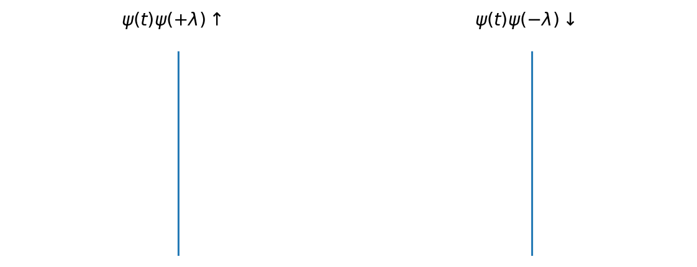

.. raw:: html

  

WaveSpin Documentation
=======================

Joint Time-Frequency Scattering, Wavelet Scattering: features for classification, regression, and synthesis of audio, biomedical, and other signals. Friendly overviews:

  - `Wavelet Scattering <https://dsp.stackexchange.com/a/78513/50076>`_
  - `Joint Time-Frequency Scattering <https://dsp.stackexchange.com/a/78623/50076>`_

For benchmarks and main overview, see `GitHub repository <https://github.com/gptanon/wavespon>`_. WaveSpin implements novel research, not just existing algorithms - see 
`Novelties <extended/novelties_testing/index.html>`_.

Installation
------------

`pip install wavespin`. Or, for latest version (most likely stable):

`pip install git+https://github.com/OverLordGoldDragon/wavespin`

Examples
--------

.. include:: _examples_gallery.txt

More examples
-------------

See `Examples <examples/index.html>`_.

Table of Contents
-----------------

.. toctree::
   :maxdepth: 2
   :caption: Core Documentation
   
   examples/index
   Scattering Docs <scattering_docs>
   hows_it_work

.. toctree::
   :maxdepth: 2
   :caption: Extended
   
   extended/performance_tips
   extended/novelties_testing/index
   extended/general_method_docs
   extended/further_reading
   API Reference <wavespin>

.. include:: silent_image_includes.txt
